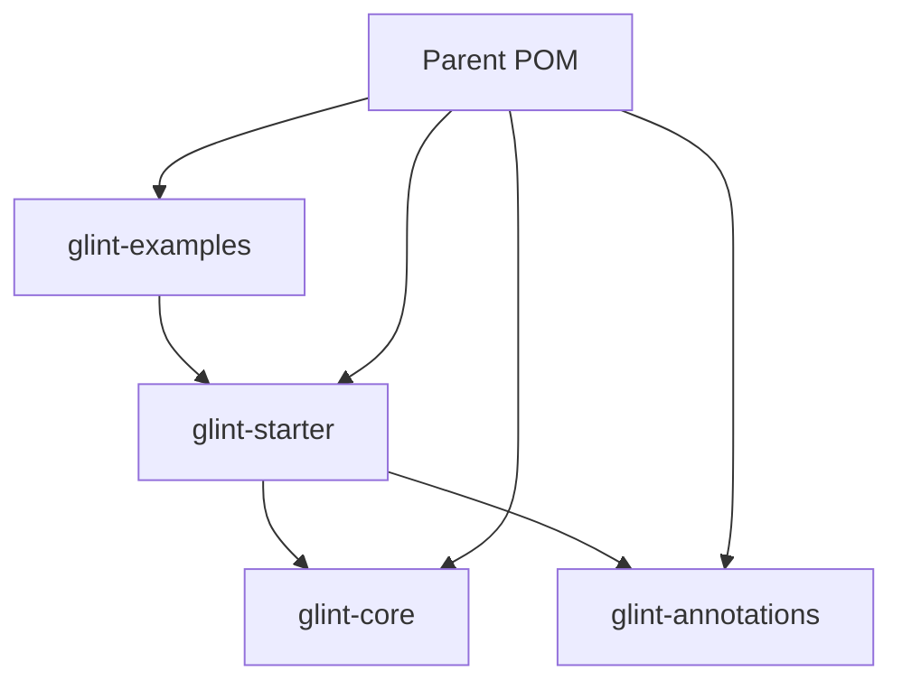

# Glint Spring Framework Architecture

## Overview

The Glint Spring Framework is designed as a multi-module Maven project that extends Spring Boot with enterprise-ready features, custom annotations, and standardized error handling. The architecture follows Apache Maven standards and implements best practices for enterprise application development.

## Architecture Principles

### 1. Modular Design
- **Separation of Concerns**: Each module has a specific responsibility
- **Loose Coupling**: Modules interact through well-defined interfaces
- **High Cohesion**: Related functionality is grouped together

### 2. Enterprise-Ready Features
- **Quick Startup**: Optimized configuration for faster application startup
- **Standardized Error Handling**: Centralized exception management
- **Custom Annotations**: Simplified development with meta-annotations
- **Code Quality**: Integrated static analysis tools

### 3. Apache Standards Compliance
- **Maven Project Structure**: Standard directory layout
- **License Compliance**: Apache License 2.0
- **Documentation Standards**: Comprehensive documentation
- **Quality Assurance**: Checkstyle, SpotBugs, CodeQL integration

## Module Architecture

```
glint-spring-framework/
├── glint-core/                 # Core framework components
├── glint-annotations/          # Custom annotations
├── glint-starter/             # Spring Boot starter
├── glint-examples/            # Example applications
└── parent-pom.xml             # Parent POM with shared configuration
```

### Module Dependencies



## Core Components

### 1. Exception Handling System

#### GlintException
- Base exception class for framework-specific errors
- Structured error information with error codes
- Context support for additional error details
- Timestamp tracking for error occurrence

#### ErrorResponse
- Standardized error response structure
- JSON serialization support
- Trace ID integration for distributed tracing
- Context information for debugging

#### GlobalExceptionHandler
- Centralized exception handling
- HTTP status code mapping
- Validation error processing
- Generic exception fallback

### 2. Custom Annotations

#### @GlintApplication
Meta-annotation combining:
- `@SpringBootApplication`
- `@EnableAspectJAutoProxy`
- `@EnableAsync`
- `@EnableScheduling`
- `@EnableTransactionManagement`

#### @GlintService
Meta-annotation combining:
- `@Service`
- `@Transactional(readOnly = true)`

#### @GlintController
Meta-annotation combining:
- `@RestController`
- API versioning support
- Request/response logging

#### @ErrorCode
Annotation for:
- Error code definition
- Message templating
- HTTP status mapping
- Error categorization

## Performance Optimizations

### 1. Startup Time Improvements

#### Lazy Initialization
```java
@Lazy
@Component
public class ExpensiveComponent {
    // Component loaded only when needed
}
```

#### Conditional Auto-configuration
```java
@ConditionalOnProperty(name = "glint.feature.enabled", havingValue = "true")
@Configuration
public class FeatureConfiguration {
    // Configuration loaded only when feature is enabled
}
```

#### Optimized Bean Scanning
- Reduced component scanning scope
- Targeted package scanning
- Exclusion of unnecessary components

### 2. Memory Optimization

#### Connection Pooling
- HikariCP integration
- Optimized pool sizing
- Connection validation

#### Caching Strategies
- Spring Cache abstraction
- Redis integration support
- Local caching fallback

#### Resource Management
- Proper resource cleanup
- Connection leak prevention
- Memory leak detection

## Security Architecture

### 1. Input Validation
- Bean Validation integration
- Custom validation annotations
- Validation error handling

### 2. SQL Injection Prevention
- JPA repository usage
- Parameterized queries
- Query validation

### 3. XSS Protection
- Request sanitization
- Response encoding
- Content Security Policy

### 4. Security Headers
- Automatic header configuration
- CSRF protection
- Session security

## Monitoring & Observability

### 1. Health Checks
- Spring Boot Actuator integration
- Custom health indicators
- Database connectivity checks

### 2. Metrics
- Application metrics
- Business metrics
- Performance metrics

### 3. Logging
- Structured logging with SLF4J
- Logback configuration
- Correlation ID support

### 4. Tracing
- Request tracing
- Distributed tracing support
- Performance monitoring

## Code Quality Architecture

### 1. Static Analysis

#### Checkstyle Configuration
- Apache-compliant coding standards
- Custom rules for Spring Boot
- Integration with Maven build

#### SpotBugs Integration
- Bug pattern detection
- Security vulnerability scanning
- Performance issue identification

#### CodeQL Analysis
- Semantic code analysis
- Security vulnerability detection
- Automated security scanning

### 2. Testing Strategy

#### Unit Testing
- JUnit 5 integration
- Mockito for mocking
- Test coverage reporting

#### Integration Testing
- Spring Boot Test integration
- TestContainers support
- Database testing

#### Contract Testing
- API contract validation
- Consumer-driven contracts
- Service integration testing

## CI/CD Pipeline Architecture

### 1. Continuous Integration

#### Build Pipeline
```yaml
- Checkout code
- Setup Java 17
- Cache Maven dependencies
- Run unit tests
- Run Checkstyle
- Run SpotBugs
- Generate JaCoCo report
- Upload coverage
```

#### Quality Gates
- Test coverage threshold
- Code quality metrics
- Security scan results
- Performance benchmarks

### 2. Continuous Deployment

#### Release Pipeline
- Semantic versioning
- Automated releases
- Artifact publishing
- Documentation generation

#### Environment Promotion
- Development environment
- Staging environment
- Production environment
- Rollback capabilities

## Configuration Management

### 1. Application Configuration
- YAML configuration support
- Environment-specific configs
- External configuration
- Configuration validation

### 2. Feature Flags
- Dynamic feature toggles
- Runtime configuration
- A/B testing support
- Gradual rollouts

## Extension Points

### 1. Custom Annotations
- Annotation processor support
- Custom validation rules
- AOP integration
- Metadata generation

### 2. Plugin Architecture
- SPI (Service Provider Interface)
- Plugin discovery
- Dynamic loading
- Configuration management

### 3. Event System
- Application events
- Domain events
- Event sourcing support
- Event replay capabilities

## Scalability Considerations

### 1. Horizontal Scaling
- Stateless design
- Session management
- Load balancing
- Service discovery

### 2. Vertical Scaling
- Memory optimization
- CPU utilization
- Resource monitoring
- Performance tuning

### 3. Database Scaling
- Connection pooling
- Read replicas
- Sharding support
- Caching strategies

## Future Enhancements

### 1. Reactive Programming
- Spring WebFlux integration
- Reactive streams
- Non-blocking I/O
- Backpressure handling

### 2. Microservices Support
- Service mesh integration
- Distributed tracing
- Circuit breakers
- Bulkhead patterns

### 3. Cloud Native Features
- Kubernetes integration
- Cloud provider support
- Serverless deployment
- Container optimization

## Best Practices

### 1. Development Practices
- Test-driven development
- Code reviews
- Pair programming
- Continuous integration

### 2. Design Patterns
- Dependency injection
- Factory pattern
- Builder pattern
- Observer pattern

### 3. Error Handling
- Fail-fast principle
- Graceful degradation
- Circuit breaker pattern
- Retry mechanisms

This architecture provides a solid foundation for enterprise Spring Boot applications while maintaining simplicity and ease of use.
